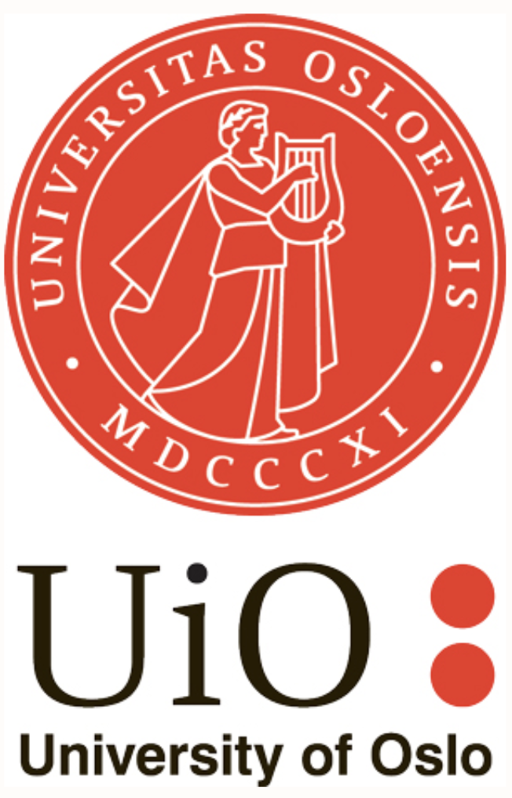
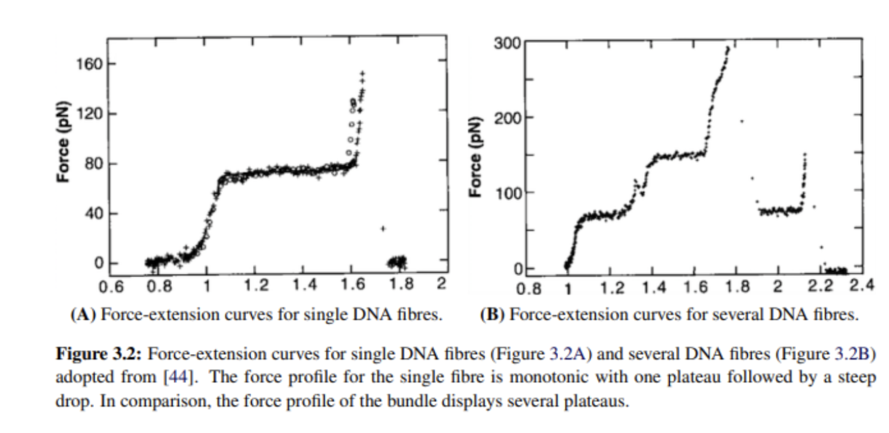
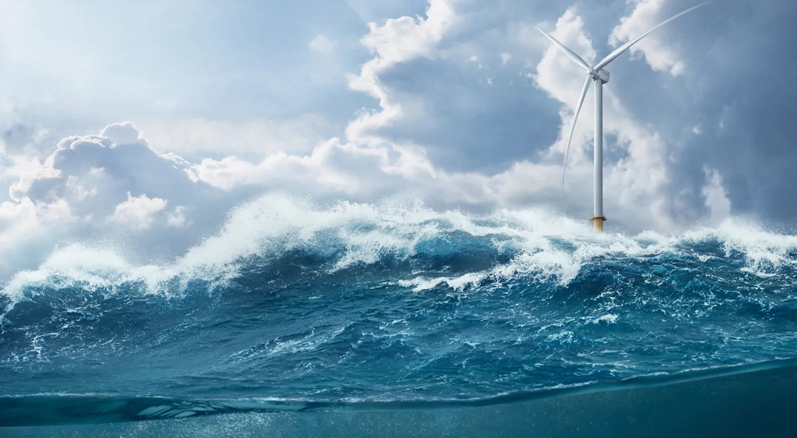

<!-- _class: title -->
<!-- paginate: false -->

# Sunniva Indrehus

## My physics journey

### Demcember 10th, 2025

---

<!-- paginate: true -->

# About Me

💼 Professional

Physics

Communication

Programming

🎨 Personal

Music

Culture & Languages

Knitting

---

# My Physics Journey

2011

NTNU
Trondheim
MSc Physics

2016

UNSAM
Buenos Aires
Spanish & Tango

2017

Sorbonne
Paris
PhD Physics

2020

UiO
Oslo
Senior Engineer

2021

NGI
Oslo
Scientific Developer

2025

Autodesk
Oslo
Software Engineer

---

# The Fiber Bundle Model

*Stretching DNA fibers*

**Modeling biopolymers like DNA**

- Statistical mechanics approach
- Failure and fracture mechanics
- Applications in material science

---

# The Fiber Bundle Model

*Stretching DNA fibers*

---

# My Physics Journey

2011

NTNU
Trondheim
MSc Physics

2016

UNSAM
Buenos Aires
Spanish & Tango

2017

Sorbonne
Paris
PhD Physics

2020

UiO
Oslo
Senior Engineer

2021

NGI
Oslo
Scientific Developer

2025

Autodesk
Oslo
Software Engineer

---

# Spanish and Tango 💃🇦🇷:violin:

---

# My Physics Journey

2011

NTNU
Trondheim
MSc Physics

2016

UNSAM
Buenos Aires
Spanish & Tango

2017

Sorbonne
Paris
PhD Physics

2020

UiO
Oslo
Senior Engineer

2021

NGI
Oslo
Scientific Developer

2025

Autodesk
Oslo
Software Engineer

---

# Plasmonics in History & Industry

*The Lycurgus Cup (4th century)*

**Ancient nanotechnology**
- Roman glass with gold/silver nanoparticles
- Changes color with light direction

---

# Monitoring Layer Growth

*Thin film layers*

*Mirror application*

*Controlling conditions*

**Modern Applications**
- Smart glass coatings
- Layer stacks for mirrors
- Thin film technology

<!-- _footer: 'Credit: Saint-Gobain, R. Lazzari' -->

---

# Experimental Setup & Modeling

**Surface Differential Reflectivity**

*SDRS technique*

- Monitor thin film growth in real-time
- Characterize nanoparticle formation
- Ag deposits on MgO substrates

<!-- _footer: 'R. Lazzari, GranFilm (2002)' -->

---

# My Physics Journey

2011

NTNU
Trondheim
MSc Physics

2016

UNSAM
Buenos Aires
Spanish & Tango

2017

Sorbonne
Paris
PhD Physics

2020

UiO
Oslo
Senior Engineer

2021

NGI
Oslo
Scientific Developer

2025

Autodesk
Oslo
Software Engineer

---

# CTSM: Norwegian Climate Modeling

<iframe src="https://player.vimeo.com/video/356868874?h=f8795629b4&autoplay=1&loop=1&muted=1&background=1" width="400" height="225" frameborder="0" allow="autoplay; fullscreen" allowfullscreen></iframe>

*Global weather simulation*

**Community Terrestrial Systems Model**

🌲 Land surface processes
🌡️ Carbon & nitrogen cycles
💧 Hydrology & permafrost
🏔️ Nordic conditions

**My contributions**
- Model development
- HPC & data pipelines

<!-- _footer: 'Video: NASA | CTSM-dev @ GitHub' -->

---

# My Physics Journey

2011

NTNU
Trondheim
MSc Physics

2016

UNSAM
Buenos Aires
Spanish & Tango

2017

Sorbonne
Paris
PhD Physics

2020

UiO
Oslo
Senior Engineer

2021

NGI
Oslo
Scientific Developer

2025

Autodesk
Oslo
Software Engineer

---

# Offshore Energy

**What we model**

🌊 Tsunami modelling

🏗️ Foundation & ground stability

💻 Scientific computing

⚙️ Automation of processes

---

# What I Do

### Computational Science

- Numerical simulations
- Data analysis
- Scientific computing
- Performance optimization

### Preaching "Good Enough" Software

- Version control (Git)
- Testing & documentation
- Code quality practices

---
