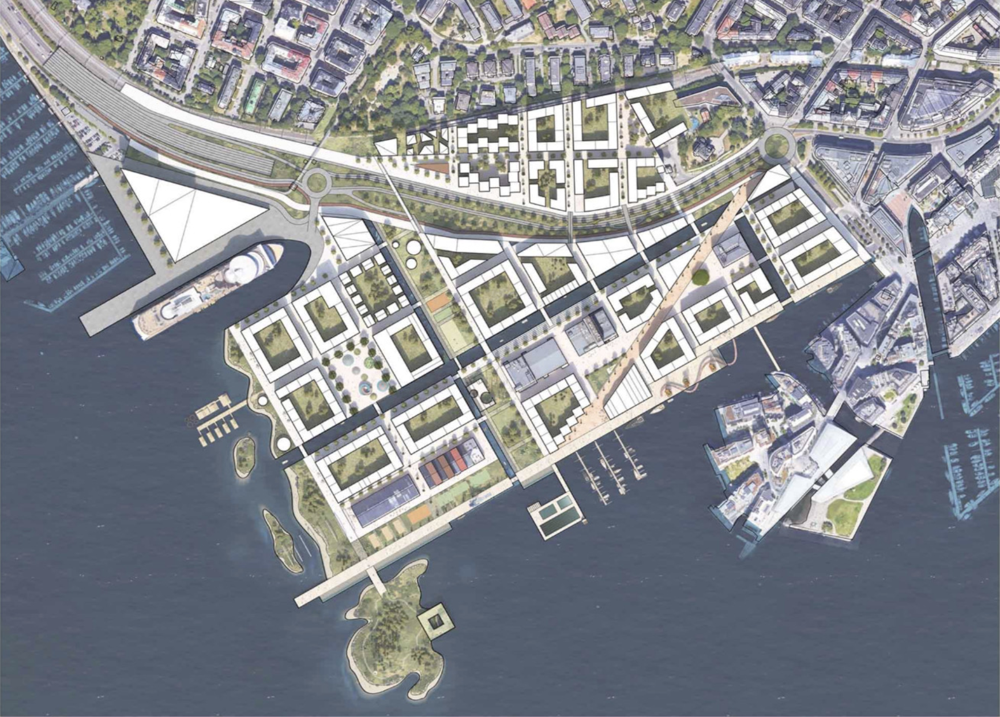

<!-- _class: title -->
<!-- paginate: false -->


# My physics journey

## Sunniva Indrehus
### Demcember 10th, 2025

---


<!-- paginate: true -->

# Me

<div style="display: grid; grid-template-columns: 1fr 1fr; gap: 2em; align-items: center;">

<div>

```bash
~$ echo $(whoami)
sunniva
```

</div>

<div style="text-align: center;">


</div>

</div>

---
# Me

<style scoped>
.category { color: #B22222; font-size: 1.3em; font-weight: bold; margin: 0.8em 0 0.3em 0; border-bottom: 2px solid #B22222; padding-bottom: 0.2em; }
.items { display: grid; grid-template-columns: repeat(3, 1fr); gap: 1.5em; text-align: center; }
.items div { font-size: 0.9em; }
</style>

<div class="category">💼 Professional</div>

<div class="items">

<div>


Physics

</div>
<div>


Communication

</div>
<div>


Programming

</div>

</div>

<div class="category">🎨 Personal</div>

<div class="items">

<div>


Music

</div>
<div>


Culture & Languages

</div>
<div>


Knitting

</div>

</div>

---

# My Physics Journey

<div class="jobs">
<div class="job highlight">
<span class="year">2011</span>

<span class="employer">NTNU</span>
<span class="place">Trondheim</span>
<span class="role">MSc Physics</span>
</div>
<div class="job">
<span class="year">2016</span>

<span class="employer">UNSAM</span>
<span class="place">Buenos Aires</span>
<span class="role">Spanish & Tango</span>
</div>
<div class="job">
<span class="year">2017</span>

<span class="employer">Sorbonne</span>
<span class="place">Paris</span>
<span class="role">PhD Physics</span>
</div>
<div class="job">
<span class="year">2020</span>

<span class="employer">UiO</span>
<span class="place">Oslo</span>
<span class="role">Senior Engineer</span>
</div>
<div class="job">
<span class="year">2021</span>

<span class="employer">NGI</span>
<span class="place">Oslo</span>
<span class="role">Scientific Developer</span>
</div>
<div class="job">
<span class="year">2025</span>

<span class="employer">Autodesk</span>
<span class="place">Oslo</span>
<span class="role">Software Engineer</span>
</div>
</div>

---

# The Fiber Bundle Model

<div style="display: grid; grid-template-columns: 1fr 1.2fr; gap: 2em; align-items: center;">

<div style="text-align: center;">


*Stretching DNA fibers*

</div>

<div>


- Statistical mechanics approach
- Failure and fracture mechanics
- Applications in material science

</div>

</div>

---

# The Fiber Bundle Model


<div style="text-align: center;">


*Numerical experiments*
</div>


---

# My Physics Journey

<div class="jobs">
<div class="job">
<span class="year">2011</span>

<span class="employer">NTNU</span>
<span class="place">Trondheim</span>
<span class="role">MSc Physics</span>
</div>
<div class="job highlight">
<span class="year">2016</span>

<span class="employer">UNSAM</span>
<span class="place">Buenos Aires</span>
<span class="role">Spanish & Tango</span>
</div>
<div class="job">
<span class="year">2017</span>

<span class="employer">Sorbonne</span>
<span class="place">Paris</span>
<span class="role">PhD Physics</span>
</div>
<div class="job">
<span class="year">2020</span>

<span class="employer">UiO</span>
<span class="place">Oslo</span>
<span class="role">Senior Engineer</span>
</div>
<div class="job">
<span class="year">2021</span>

<span class="employer">NGI</span>
<span class="place">Oslo</span>
<span class="role">Scientific Developer</span>
</div>
<div class="job">
<span class="year">2025</span>

<span class="employer">Autodesk</span>
<span class="place">Oslo</span>
<span class="role">Software Engineer</span>
</div>
</div>

---

# Spanish and Tango 💃🇦🇷:violin:

---

# My Physics Journey

<div class="jobs">
<div class="job">
<span class="year">2011</span>

<span class="employer">NTNU</span>
<span class="place">Trondheim</span>
<span class="role">MSc Physics</span>
</div>
<div class="job">
<span class="year">2016</span>

<span class="employer">UNSAM</span>
<span class="place">Buenos Aires</span>
<span class="role">Spanish & Tango</span>
</div>
<div class="job highlight">
<span class="year">2017</span>

<span class="employer">Sorbonne</span>
<span class="place">Paris</span>
<span class="role">PhD Physics</span>
</div>
<div class="job">
<span class="year">2020</span>

<span class="employer">UiO</span>
<span class="place">Oslo</span>
<span class="role">Senior Engineer</span>
</div>
<div class="job">
<span class="year">2021</span>

<span class="employer">NGI</span>
<span class="place">Oslo</span>
<span class="role">Scientific Developer</span>
</div>
<div class="job">
<span class="year">2025</span>

<span class="employer">Autodesk</span>
<span class="place">Oslo</span>
<span class="role">Software Engineer</span>
</div>
</div>

---


# Plasmonics in History

<div style="display: grid; grid-template-columns: 1fr 1.2fr; gap: 2em; align-items: center;">

<div style="text-align: center;">


*The Lycurgus Cup (4th century)*

</div>

<div>

- Ancient nanotechnology
- Roman glass with gold/silver nanoparticles
- Changes color with light direction


</div>

</div>


---


# Plasmonics in the Industry


<div style="display: grid; grid-template-columns: 1.2fr 1fr; gap: 1.5em; align-items: start;">

<div style="text-align: center; font-size: 0.85em;">


*Thin film layers*


*Mirror application*

</div>


<div style="margin-top: 1.5em;">

**Modern Applications**
- Smart glass coatings
- Layer stacks for mirrors
- Thin film technology


</div>

</div>

<!-- _footer: 'Credit: Saint-Gobain, R. Lazzari' -->


---

# Monitoring layer growth

<div style="display: grid; grid-template-columns: 1fr 1fr; gap: 2em; align-items: start;">

<div style="text-align: center;">

**Surface Differential Reflectivity**


*SDRS technique*

</div>

<div style="font-size: 0.95em;">

<div style="text-align: center; margin-bottom: 0.5em;">


*Controlling conditions*

</div>

- Monitor thin film growth in real-time
- Characterize nanoparticle formation
- Ag deposits on MgO substrates

</div>

</div>

<!-- _footer: 'R. Lazzari, GranFilm (2002)' -->

---

# My Physics Journey

<div class="jobs">
<div class="job">
<span class="year">2011</span>

<span class="employer">NTNU</span>
<span class="place">Trondheim</span>
<span class="role">MSc Physics</span>
</div>
<div class="job">
<span class="year">2016</span>

<span class="employer">UNSAM</span>
<span class="place">Buenos Aires</span>
<span class="role">Spanish & Tango</span>
</div>
<div class="job">
<span class="year">2017</span>

<span class="employer">Sorbonne</span>
<span class="place">Paris</span>
<span class="role">PhD Physics</span>
</div>
<div class="job highlight">
<span class="year">2020</span>

<span class="employer">UiO</span>
<span class="place">Oslo</span>
<span class="role">Senior Engineer</span>
</div>
<div class="job">
<span class="year">2021</span>

<span class="employer">NGI</span>
<span class="place">Oslo</span>
<span class="role">Scientific Developer</span>
</div>
<div class="job">
<span class="year">2025</span>

<span class="employer">Autodesk</span>
<span class="place">Oslo</span>
<span class="role">Software Engineer</span>
</div>
</div>

---

# CTSM: Norwegian Climate Modeling

<div style="display: grid; grid-template-columns: 1.3fr 1fr; gap: 1.5em; align-items: center;">

<div style="text-align: center;">

<iframe src="https://player.vimeo.com/video/356868874?h=f8795629b4&autoplay=1&loop=1&muted=1&background=1" width="400" height="225" frameborder="0" allow="autoplay; fullscreen" allowfullscreen></iframe>

*Global weather simulation*

</div>

<div style="font-size: 0.85em;">

**Community Terrestrial Systems Model**

🌲 Land surface processes
🌡️ Carbon & nitrogen cycles
💧 Hydrology & permafrost


</div>

</div>

<!-- _footer: 'Video: NASA | CTSM-dev @ GitHub' -->

---

# My Physics Journey

<div class="jobs">
<div class="job">
<span class="year">2011</span>

<span class="employer">NTNU</span>
<span class="place">Trondheim</span>
<span class="role">MSc Physics</span>
</div>
<div class="job">
<span class="year">2016</span>

<span class="employer">UNSAM</span>
<span class="place">Buenos Aires</span>
<span class="role">Spanish & Tango</span>
</div>
<div class="job">
<span class="year">2017</span>

<span class="employer">Sorbonne</span>
<span class="place">Paris</span>
<span class="role">PhD Physics</span>
</div>
<div class="job">
<span class="year">2020</span>

<span class="employer">UiO</span>
<span class="place">Oslo</span>
<span class="role">Senior Engineer</span>
</div>
<div class="job highlight">
<span class="year">2021</span>

<span class="employer">NGI</span>
<span class="place">Oslo</span>
<span class="role">Scientific Developer</span>
</div>
<div class="job">
<span class="year">2025</span>

<span class="employer">Autodesk</span>
<span class="place">Oslo</span>
<span class="role">Software Engineer</span>
</div>
</div>

---

# Offshore Energy Department

<div style="display: grid; grid-template-columns: 1fr 1fr; gap: 1.5em; align-items: center;">
<div>


</div>

<div>


🌊 Tsunamis

🏗️ Foundation & ground stability

💻 Scientific computing

⚙️ Automation of processes

</div>

</div>

---

# Physics model

<div style="display: grid; grid-template-columns: repeat(4, 1fr); gap: 0.5em; align-items: end; justify-items: center; margin-top: 2em;">

<div style="text-align: center;">


</div>

<div style="text-align: center;">


</div>

<div style="text-align: center;">


</div>

<div style="text-align: center;">


</div>

</div>

---


# My Physics Journey

<div class="jobs">
<div class="job">
<span class="year">2011</span>

<span class="employer">NTNU</span>
<span class="place">Trondheim</span>
<span class="role">MSc Physics</span>
</div>
<div class="job">
<span class="year">2016</span>

<span class="employer">UNSAM</span>
<span class="place">Buenos Aires</span>
<span class="role">Spanish & Tango</span>
</div>
<div class="job">
<span class="year">2017</span>

<span class="employer">Sorbonne</span>
<span class="place">Paris</span>
<span class="role">PhD Physics</span>
</div>
<div class="job">
<span class="year">2020</span>

<span class="employer">UiO</span>
<span class="place">Oslo</span>
<span class="role">Senior Engineer</span>
</div>
<div class="job ">
<span class="year">2021</span>

<span class="employer">NGI</span>
<span class="place">Oslo</span>
<span class="role">Scientific Developer</span>
</div>
<div class="job highlight">
<span class="year">2025</span>

<span class="employer">Autodesk</span>
<span class="place">Oslo</span>
<span class="role">Software Engineer</span>
</div>
</div>

---

#  🎬 Movie time 🎬

<div style="display: flex; justify-content: center; margin-top: 1em;">

<iframe src="https://boards.autodesk.com/corporate-sustainability/items/what-is-forma" width="800" height="450" frameborder="0" allow="autoplay; fullscreen" allowfullscreen></iframe>

</div>

---
# Building better cities with iterative design 

<div style="display: grid; grid-template-columns: 1fr 1fr; gap: 1.5em; align-items: center; margin-top: 1em;">

<div style="text-align: center;">


*Oslo Kommune - Filipstad*

</div>

<div style="text-align: center;">



*MAD Arkitekter - Filipstad*

</div>

</div>

---

<style scoped>
h1 { font-size: 1.8em; }
</style>

# Understand a simplified version of the real world

<div style="text-align: center;">


*A model of a horse*

</div>

<!-- _footer: Credit: Horse illustration: - [Ali Bati ](https://www.alibati.com/horse) -->
